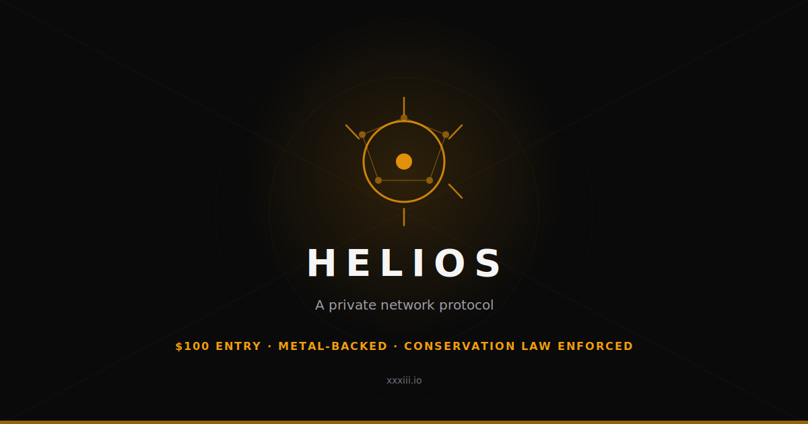
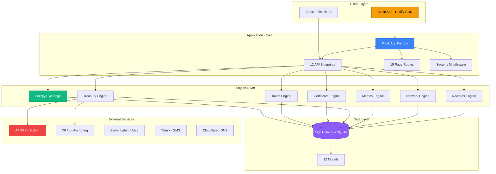
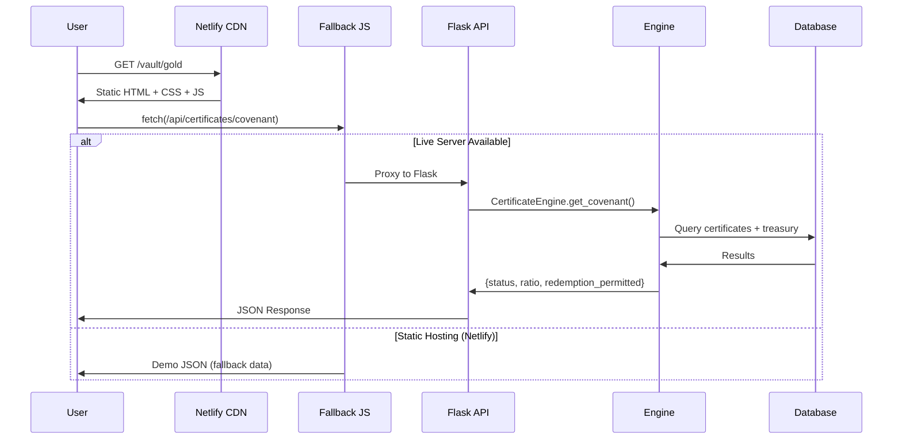
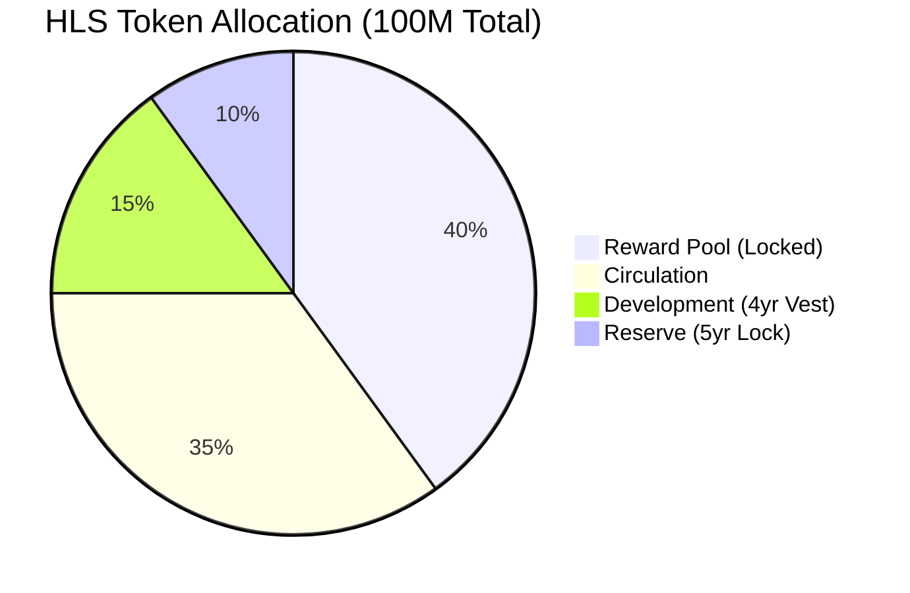
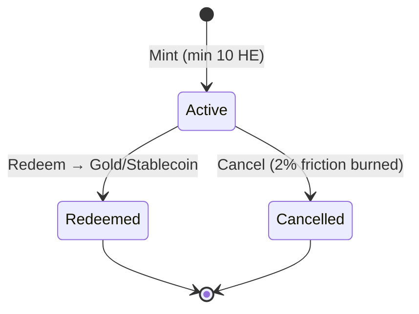
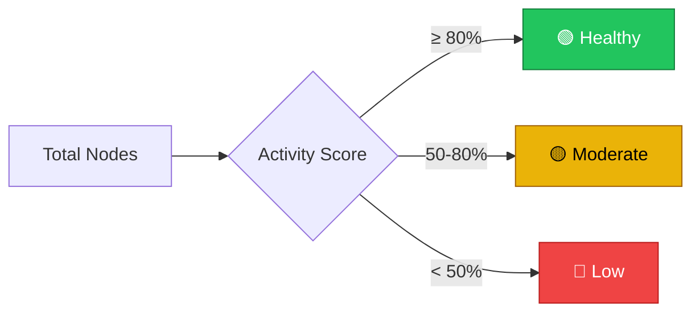
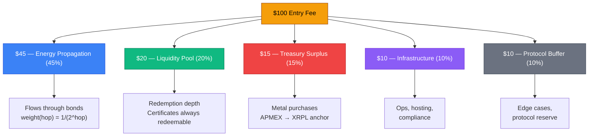
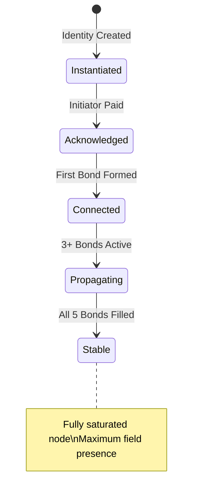
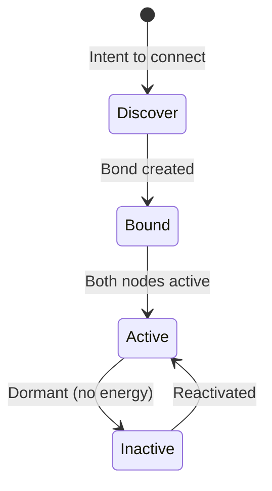
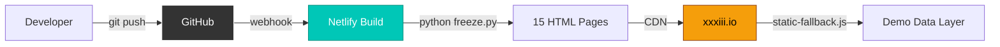

<div align="center">

# ☀ HELIOS

### A Private Network Protocol

**Fixed supply · Bounded field · Protocol-enforced settlement**

[](https://python.org)
[](https://flask.palletsprojects.com)
[](LICENSE)
[](https://xxxiii.io)
[]()

<br>



<br>

**`xxxiii.io`** — $100 entry · Metal-backed treasury · Energy certificates · Conservation law enforced

</div>

---

## 📑 Table of Contents

| # | Section | Description |
|:-:|:--------|:------------|
| 🟡 | [Protocol Overview](#-protocol-overview) | What Helios is and why it exists |
| 🟠 | [Architecture](#-architecture) | System design, layers, and data flow |
| 🔴 | [Smart Contracts](#-smart-contracts) | Token, certificates, treasury, settlement |
| 🟣 | [Metrics & Formulas](#-metrics--formulas) | SR-level analytics and health scoring |
| 🔵 | [Energy Exchange](#-energy-exchange) | Conservation law, propagation, absorption |
| 🟢 | [Project Structure](#-project-structure) | Directory tree with annotations |
| ⚪ | [API Reference](#-api-reference) | 95 routes — pages, APIs, health |
| 🟤 | [Deployment](#-deployment) | Netlify static, production server, freeze pipeline |
| ⚫ | [Configuration](#-configuration) | Protocol parameters and structural invariants |
| 🔶 | [Getting Started](#-getting-started) | Install, run, develop, deploy |

---

## 🟡 Protocol Overview

Helios is a **private network protocol** where human connections inject energy and the system distributes it according to physics, not position.

```
┌─────────────────────────────────────────────────────────────┐
│                    HELIOS PROTOCOL                          │
│                                                             │
│  ┌─────────┐   ┌──────────┐   ┌───────────┐   ┌────────┐  │
│  │ BOUNDED  │──▶│  ENERGY  │──▶│  TREASURY │──▶│ VERIFY │  │
│  │  FIELD   │   │   FLOW   │   │   SPINE   │   │  LAYER │  │
│  └─────────┘   └──────────┘   └───────────┘   └────────┘  │
│                                                             │
│  Power of 5     Conservation    Metal-backed   Public APIs  │
│  Max 5 bonds    Law enforced    APMEX + XRPL   Anyone can   │
│  15 hop decay   ∑in = ∑out      Quarterly PoR  audit        │
└─────────────────────────────────────────────────────────────┘
```

### Core Principles

| Principle | Rule | Enforcement |
|:----------|:-----|:------------|
| 🔒 **Fixed Supply** | 100,000,000 HLS | No minting function exists |
| ⬡ **Bounded Field** | Max 5 bonds per node | Protocol-enforced at creation |
| ⚡ **Energy Propagation** | `weight(hop) = 1/(2^hop)` | 15 hops max, then absorption |
| ⚖ **Conservation Law** | `∑ inflows = routed + stored + pooled + burned` | Verified every transaction |
| 🥇 **Metal-Backed** | Treasury → APMEX gold/silver | XRPL SHA-256 anchored |
| ◉ **Atomic Entry** | $100 — every dollar has a destination | Split enforced at injection |

---

## 🟠 Architecture

### System Layers



### Request Flow



---

## 🔴 Smart Contracts

### Token Contract — HLS

```
╔══════════════════════════════════════════════════════╗
║              HLS TOKEN — IMMUTABLE RULES             ║
╠══════════════════════════════════════════════════════╣
║  Total Supply:     100,000,000 HLS                   ║
║  Decimals:         8                                 ║
║  Minting:          IMPOSSIBLE — no mint function     ║
║  Admin Override:   IMPOSSIBLE — no admin keys        ║
║  Supply Audit:     PUBLIC — anyone can verify        ║
╚══════════════════════════════════════════════════════╝
```

#### Token Allocation



| Pool | % | Amount | Status | Lock |
|:-----|--:|-------:|:-------|:-----|
| 🟡 Reward Pool | 40% | 40,000,000 HLS | `locked` | Smart contract |
| 🟢 Circulation | 35% | 35,000,000 HLS | `distributing` | — |
| 🔵 Development | 15% | 15,000,000 HLS | `vesting` | 4-year vest |
| 🔴 Reserve | 10% | 10,000,000 HLS | `locked` | 5-year lock |

#### Anti-Rug Guarantees

```python
anti_rug = {
    "can_mint": False,              # No minting function in code
    "founder_lock_years": 3,        # Founders locked out for 3 years
    "pool_locked": True,            # Reward pool is smart-contract locked
    "supply_auditable": True,       # GET /api/token/verify — anyone
    "admin_override_possible": False # No admin keys exist
}
```

### Certificate Contract — HC-NFT



| Operation | Rule | Verification |
|:----------|:-----|:-------------|
| **Mint** | Min 10 HE, stores energy at current rate | `/api/certificates/mint` |
| **Redeem (Gold)** | Full energy value → physical gold via APMEX | `/api/certificates/redeem/gold` |
| **Redeem (Stablecoin)** | Full energy value → stablecoin equivalent | `/api/certificates/redeem/stablecoin` |
| **Cancel** | Returns energy minus 2% friction (burned) | `/api/certificates/cancel` |

### Treasury Contract — Metal Vault


| Parameter | Value | Description |
|:----------|:------|:------------|
| Metal Coefficient (m) | 0.05 – 0.12 | Adjusts based on treasury health |
| Default m | 0.07 | 7% of net surplus → metal |
| Dealers | APMEX | Approved bullion dealer |
| Audit Interval | 90 days | Quarterly proof-of-reserves |
| Anchoring | XRPL | SHA-256 hash on XRP Ledger |
| Metals | Gold, Silver, Platinum, Palladium | All tracked |

---

## 🟣 Metrics & Formulas

### SR-Level Protocol Health Dashboard

Four metrics that define whether the protocol is healthy, stressed, or critical:

```
┌────────────────────────────────────────────────────────────────┐
│                   PROTOCOL HEALTH METRICS                      │
├────────────┬──────────────────────────────┬────────┬──────────┤
│   Metric   │         Formula              │ Target │  Status  │
├────────────┼──────────────────────────────┼────────┼──────────┤
│ RRR        │ LiquidTreasury / 30d_Demand  │ ≥ 3.0  │ 🟢 4.20 │
│ η (Flow)   │ (Routed+Stored+Pooled) / In  │ ≥ 0.95 │ 🟢 0.97 │
│ CP (Churn) │ CancelRequests / ActiveNodes  │ < 0.02 │ 🟢 0.01 │
│ V (Vel.)   │ Transfers_7d / StoredEnergy   │ ~ 0.30 │ 🟢 0.38 │
└────────────┴──────────────────────────────┴────────┴──────────┘
```

#### Reserve Ratio (RRR)

$$RRR = \frac{\text{Liquid Treasury (USD)}}{\text{30-day Redemption Demand (USD)}}$$

| Range | Status | Action |
|:------|:-------|:-------|
| 🟢 ≥ 3.0 | **Healthy** | Normal operations |
| 🟡 ≥ 1.5 | **Warning** | Increase metal purchases |
| 🔴 < 1.0 | **Critical** | Pause redemptions |

#### Flow Efficiency (η)

$$\eta = \frac{\text{Routed} + \text{Stored} + \text{Pooled}}{\text{Total Inflows}}$$

Target: **≥ 0.95** (95%+ of energy accounted for)

#### Churn Pressure (CP)

$$CP = \frac{\text{Cancel Requests (30d)}}{\text{Active Nodes}}$$

| Range | Status |
|:------|:-------|
| 🟢 < 0.02 | Healthy |
| 🟡 < 0.05 | Warning |
| 🔴 ≥ 0.05 | Review required |

#### Energy Velocity (V)

$$V = \frac{\text{Transfers (7d)}}{\text{Total Stored Energy}}$$

Target: **~0.30** — healthy circulation without instability

### Network Health Scoring



---

## 🔵 Energy Exchange

### Conservation Law

> **Every unit of energy is accounted for. No leaks. No hidden pools.**

$$\sum \text{Inflows} = \text{Routed} + \text{Stored} + \text{Pooled} + \text{Burned}$$

Verifiable: **`GET /api/energy/conservation`**

### $100 Entry — Atomic Split



### Energy Propagation — Hop Decay

```
Hop   Weight      Visualization
──────────────────────────────────────────
 1    50.000%     ████████████████████████████████████████ 
 2    25.000%     ████████████████████
 3    12.500%     ██████████
 4     6.250%     █████
 5     3.125%     ██▌
 6     1.563%     █▎
 7     0.781%     ▋
 ·       ·        ·
15     0.003%     ▏ → absorbed into protocol pools
```

### Energy Instruments

| Instrument | Symbol | Role | Lifecycle |
|:-----------|:-------|:-----|:----------|
| 🏷 **Helios Name** | `name.helios` | Identity NFT | Permanent |
| ⚡ **Helios Energy** | HE | Utility unit — flows through bonds | Transient |
| 🔋 **Helios Certificate** | HC-NFT | Stored energy battery | Mint → Redeem/Cancel |
| 💳 **Helios Vault Credit** | HVC | Internal accounting unit | Internal |

### Node State Machine



### Bond State Machine



### Absorption Pools (Post Hop-15)

After the propagation horizon, the fractional remainder absorbs into protocol pools:

| Pool | % | Purpose |
|:-----|--:|:--------|
| 🔵 Stability | 40% | Long-term protocol stability |
| 🟢 Liquidity | 25% | Network liquidity depth |
| 🟣 Intelligence | 20% | Protocol AI / analytics |
| 🟤 Compliance | 15% | Audit & compliance buffers |

---

## 🟢 Project Structure

```
helios-os/
│
├── 📄 app.py                    ← Application factory (Flask)
├── 📄 config.py                 ← All protocol parameters (immutable rules)
├── 📄 wsgi.py                   ← Production WSGI entry point (Waitress)
├── 📄 freeze.py                 ← Static site generator (Netlify)
├── 📄 audit.py                  ← Full system audit (12 categories)
├── 📄 verify_launch.py          ← Launch verification script
├── 📄 requirements.txt          ← Pinned dependencies
├── 📄 netlify.toml              ← Netlify build + deploy config
├── 📄 _headers                  ← Netlify edge headers (CDN caching)
├── 📄 .env.example              ← Environment template
│
├── 🔷 api/
│   ├── __init__.py
│   └── routes.py                ← 12 blueprints, 80+ API endpoints
│
├── 🟢 core/                     ← Protocol engines (business logic)
│   ├── certificates.py          ← HC-NFT mint / redeem / cancel
│   ├── energy_exchange.py       ← Conservation-law-enforced flow
│   ├── identity.py              ← name.helios creation + recovery
│   ├── infrastructure.py        ← Cloudflare, DNS, SSL management
│   ├── metrics.py               ← SR-level analytics (RRR, η, CP, V)
│   ├── network.py               ← Bounded field graph operations
│   ├── rewards.py               ← Settlement + hop decay rewards
│   ├── sms.py                   ← Phone verification (Telnyx)
│   ├── spaces.py                ← Rooms + events system
│   ├── token.py                 ← HLS token engine (no minting)
│   ├── treasury.py              ← Metal purchases + XRPL anchoring
│   ├── voice.py                 ← ElevenLabs voice AI
│   └── wallet.py                ← Balance, send, receive, history
│
├── 🟣 models/                   ← SQLAlchemy ORM models
│   ├── member.py                ← Core identity model
│   ├── bond.py                  ← Node-to-node connections
│   ├── certificate.py           ← HC-NFT certificates
│   ├── credential.py            ← Operator/vendor credentials
│   ├── energy_event.py          ← Energy ledger (every movement)
│   ├── reward.py                ← Settlement rewards
│   ├── space.py                 ← Spaces + events
│   ├── subscription.py          ← Premium tier subscriptions
│   ├── token_pool.py            ← Token pool balances
│   ├── transaction.py           ← Financial transactions
│   ├── vault_receipt.py         ← Metal vault receipts (MVR)
│   └── wallet_tx.py             ← Wallet transaction history
│
├── 🤖 ai/
│   └── ask_helios.py            ← GPT-4 integration (Ask Helios)
│
├── 🎨 static/
│   ├── css/helios.css           ← Full design system (~1100 lines)
│   ├── js/static-fallback.js    ← Netlify fallback layer (demo data)
│   ├── js/network-viz.js        ← D3.js neural field visualization
│   └── img/og-helios.svg        ← Social share card (OG image)
│
├── 📝 templates/                ← Jinja2 HTML templates
│   ├── base.html                ← Shared layout (OG tags, nav, footer)
│   ├── index.html               ← Landing page (animated coin, neural bg)
│   ├── dashboard.html           ← Member dashboard
│   ├── network.html             ← D3 field visualization
│   ├── ask.html                 ← AI chat + voice interface
│   ├── treasury.html            ← Metal reserves + receipts
│   ├── vault.html               ← Certificate management
│   ├── vault_gold.html          ← Gold Vault (APMEX catalog)
│   ├── metrics.html             ← SR-level protocol metrics
│   ├── status.html              ← System status page
│   ├── join.html                ← 4-step onboarding flow
│   ├── activate.html            ← $100 allocation breakdown
│   └── error.html               ← Custom error pages (404/500)
│
├── 📁 data/                     ← Runtime data (gitignored)
│   └── helios.db                ← SQLite database
│
└── 📁 build/                    ← Frozen static site (gitignored)
    ├── index.html               ← 15 frozen HTML pages
    ├── static/                  ← CSS, JS, images
    ├── _headers                 ← CDN cache rules
    └── BUILD_ID.txt             ← Deploy stamp
```

---

## ⚪ API Reference

### Page Routes (15)

| Route | Template | Description |
|:------|:---------|:------------|
| `GET /` | index.html | Landing — animated coin, neural field bg |
| `GET /dashboard` | dashboard.html | Member dashboard — balance, history, network |
| `GET /field` | network.html | D3 field visualization |
| `GET /network` | network.html | Alias for /field |
| `GET /ask` | ask.html | AI chat + voice (Ask Helios) |
| `GET /protocol` | status.html | Protocol status + infrastructure |
| `GET /status` | status.html | Alias for /protocol |
| `GET /treasury` | treasury.html | Metal reserves + vault receipts |
| `GET /vault` | vault.html | Certificate management |
| `GET /vault/gold` | vault_gold.html | 🥇 Gold Vault — APMEX catalog |
| `GET /activate` | activate.html | $100 allocation breakdown |
| `GET /metrics` | metrics.html | SR-level protocol health |
| `GET /enter/<ref>` | join.html | Referral entry point |
| `GET /join/<ref>` | join.html | 4-step onboarding flow |
| `GET /health` | JSON | System health check |

### API Endpoints (80+)

<details>
<summary><strong>🔐 Identity</strong> — Create, verify, recover</summary>

| Method | Endpoint | Description |
|:-------|:---------|:------------|
| `POST` | `/api/identity/create` | Create new helios identity |
| `GET` | `/api/identity/verify/:id` | Verify identity exists |
| `POST` | `/api/identity/recover` | Recover with 12-word phrase |
| `GET` | `/api/identity/qr/:id` | Get identity QR code |

</details>

<details>
<summary><strong>⬡ Field / Network</strong> — Bonds, graph, stats</summary>

| Method | Endpoint | Description |
|:-------|:---------|:------------|
| `POST` | `/api/field/bond` | Create a bond between nodes |
| `POST` | `/api/field/bond/dissolve` | Dissolve an existing bond |
| `GET` | `/api/field/bonds/:id` | List bonds for a node |
| `GET` | `/api/field/graph/:id` | Get network graph (D3 data) |
| `GET` | `/api/field/stats/:id` | Get node statistics |
| `GET` | `/api/field/status` | Global field status |
| `GET` | `/api/field/path/:from/:to` | Find path between nodes |

</details>

<details>
<summary><strong>⚡ Energy</strong> — Inject, propagate, conserve</summary>

| Method | Endpoint | Description |
|:-------|:---------|:------------|
| `POST` | `/api/energy/inject` | Inject energy (entry event) |
| `POST` | `/api/energy/propagate` | Trigger propagation |
| `POST` | `/api/energy/execute` | Execute energy transfer |
| `GET` | `/api/energy/balance/:id` | Get energy balance (HE) |
| `GET` | `/api/energy/history/:id` | Energy event history |
| `GET` | `/api/energy/total/:id` | Total energy for node |
| `GET` | `/api/energy/conservation` | ⚖ Conservation law check |
| `GET` | `/api/energy/protocol` | Energy protocol parameters |
| `GET` | `/api/energy/map` | Global energy flow map |

</details>

<details>
<summary><strong>🔋 Certificates</strong> — Mint, redeem, cancel</summary>

| Method | Endpoint | Description |
|:-------|:---------|:------------|
| `POST` | `/api/certificates/mint` | Mint HC-NFT certificate |
| `POST` | `/api/certificates/redeem/gold` | Redeem → physical gold |
| `POST` | `/api/certificates/redeem/stablecoin` | Redeem → stablecoin |
| `POST` | `/api/certificates/cancel` | Cancel (2% friction burned) |
| `GET` | `/api/certificates/list` | List all certificates |
| `GET` | `/api/certificates/active` | Active certificate count |
| `GET` | `/api/certificates/covenant` | Covenant health check |
| `GET` | `/api/certificates/portfolio/:id` | Portfolio for node |
| `GET` | `/api/certificates/burned` | Total energy burned |
| `GET` | `/api/certificates/:id` | Get specific certificate |

</details>

<details>
<summary><strong>🥇 Treasury</strong> — Metal reserves, XRPL anchoring</summary>

| Method | Endpoint | Description |
|:-------|:---------|:------------|
| `GET` | `/api/treasury/reserves` | Proof of reserves |
| `GET` | `/api/treasury/receipts` | All vault receipts |
| `GET` | `/api/treasury/receipt/:id` | Specific MVR receipt |
| `POST` | `/api/treasury/receipt` | Create new receipt |
| `POST` | `/api/treasury/anchor` | Anchor to XRPL |
| `POST` | `/api/treasury/custody` | Update custody status |
| `POST` | `/api/treasury/allocation` | Treasury allocation |

</details>

<details>
<summary><strong>💰 Wallet</strong> — Balance, send, receive</summary>

| Method | Endpoint | Description |
|:-------|:---------|:------------|
| `GET` | `/api/wallet/balance/:id` | Wallet balance |
| `GET` | `/api/wallet/history/:id` | Transaction history |
| `POST` | `/api/wallet/send` | Send tokens |
| `GET` | `/api/wallet/receive-qr/:id` | Receive QR code |

</details>

<details>
<summary><strong>📊 Metrics</strong> — SR-level protocol analytics</summary>

| Method | Endpoint | Description |
|:-------|:---------|:------------|
| `GET` | `/api/metrics/all` | All 4 health metrics |
| `GET` | `/api/metrics/health` | Network health summary |
| `GET` | `/api/metrics/rrr` | Reserve Ratio |
| `GET` | `/api/metrics/flow-efficiency` | Flow efficiency (η) |
| `GET` | `/api/metrics/churn` | Churn pressure |
| `GET` | `/api/metrics/velocity` | Energy velocity |

</details>

<details>
<summary><strong>🪙 Token</strong> — Supply, verify, founder lock</summary>

| Method | Endpoint | Description |
|:-------|:---------|:------------|
| `GET` | `/api/token/info` | Full token parameters |
| `GET` | `/api/token/supply` | Supply statistics |
| `GET` | `/api/token/verify` | ✅ Protocol verification |
| `GET` | `/api/token/founder-lock` | Founder lock status |
| `GET` | `/api/token/pools` | Pool balances |

</details>

<details>
<summary><strong>⚙️ More</strong> — Chat, voice, SMS, spaces, rewards, infra</summary>

| Blueprint | Endpoints | Description |
|:----------|:----------|:------------|
| `chat_bp` | `/api/chat/ask`, `/api/chat/quick-answers` | AI assistant |
| `voice_bp` | `/api/voice/speak`, `/api/voice/status`, `/api/voice/voices` | ElevenLabs voice |
| `sms_bp` | `/api/sms/verify/send`, `/api/sms/verify/confirm`, `/api/sms/status` | Phone verification |
| `spaces_bp` | `/api/spaces/create`, `/api/spaces/list`, `/api/spaces/event` | Rooms + events |
| `rewards_bp` | `/api/rewards/protocol`, `/api/rewards/pool`, `/api/rewards/total/:id` | Settlement rewards |
| `infra_bp` | `/api/infra/status`, `/api/infra/dns`, `/api/infra/ssl`, `/api/infra/analytics` | Infrastructure |

</details>

---

## 🟤 Deployment

### Architecture



### Freeze Pipeline

```
freeze.py
  ├── Generate BUILD_ID (timestamp + git SHA)
  ├── Boot Flask app via create_app()
  ├── Fetch 15 pages via test_client
  ├── Validate HTML (no malformed font links)
  ├── Copy static assets (CSS, JS, images)
  ├── Copy _headers (CDN cache rules)
  └── Write BUILD_ID.txt
```

### Netlify Config

- **Build command:** `python freeze.py`
- **Publish directory:** `build/`
- **Post-processing:** Disabled (prevents HTML corruption)
- **Referral rewrites:** `/enter/*`, `/join/*`, `/activate/*` → serve base page
- **API routes:** Return 404 (handled by static-fallback.js)
- **Static caching:** 1 year, immutable

---

## ⚫ Configuration

All protocol parameters live in `config.py`. Structural invariants are enforced at startup:

```python
assert token_allocation == 100%         # 40 + 35 + 15 + 10
assert absorption_pools == 100%         # 40 + 25 + 20 + 15
assert energy_allocation == 100%        # 45 + 20 + 15 + 10 + 10
assert FIELD_MAX_BONDS == 5             # Power of 5
assert PROPAGATION_MAX_HOPS == 15       # Energy horizon
assert ENTRY_FEE_USD == 100             # Atomic entry
assert CERTIFICATE_CANCEL_FRICTION == 0.02  # 2% burn
```

### Premium Tiers

| Tier | Price | Features |
|:-----|------:|:---------|
| 🟢 **Base** | $100 entry | Identity, bonds, energy, certificates |
| 🔵 **Plus** | $20/mo | + Vault access |
| 🟣 **Pro** | $99/mo | + Spaces + Credentials |
| 🔴 **Operator** | $499/mo | Full operator suite |

---

## 🔶 Getting Started

### Prerequisites

- Python 3.11+
- pip

### Install

```bash
git clone https://github.com/unykornai/Helios.git
cd Helios
pip install -r requirements.txt
cp .env.example .env
```

### Run (Development)

```bash
python app.py
# → http://localhost:5050
```

### Run (Production)

```bash
python wsgi.py
# Uses Waitress WSGI server
```

### Build for Netlify

```bash
python freeze.py
# → /build directory with 15 frozen pages
```

### Audit

```bash
python audit.py
# Tests: config, routes, pages, APIs, models, core, freeze, netlify
```

### Verify Launch

```bash
python verify_launch.py
# Tests: token contract, treasury, certificates, metrics, all pages
```

---

<div align="center">

### Verification Endpoints

| Endpoint | What It Proves |
|:---------|:---------------|
| [`/api/token/info`](https://xxxiii.io/api/token/info) | Token parameters are immutable |
| [`/api/token/verify`](https://xxxiii.io/api/token/verify) | Supply is correct, no mint function |
| [`/api/token/founder-lock`](https://xxxiii.io/api/token/founder-lock) | Founders locked 3 years |
| [`/api/treasury/reserves`](https://xxxiii.io/api/treasury/reserves) | Metal reserves are real |
| [`/api/energy/conservation`](https://xxxiii.io/api/energy/conservation) | Conservation law holds |
| [`/api/metrics/all`](https://xxxiii.io/api/metrics/all) | Protocol health is public |
| [`/api/certificates/covenant`](https://xxxiii.io/api/certificates/covenant) | Certificates are redeemable |

---

**Don't trust. Verify.**

`xxxiii.io`

☀

</div>
