<div align="center">

# ☀ HELIOS

### A Private Network Protocol

**Pentagonal geometry · Conservation law · Physics-based settlement · Metal spine**

[](https://python.org)
[](https://flask.palletsprojects.com)
[](LICENSE)
[](https://xxxiii.io)
[]()

<br>


<br>

**`xxxiii.io`** — $100 atomic entry · Pentagonal bounded field · Metal-backed treasury · Cryptographic certificates · Conservation law

</div>

---

## 📑 Table of Contents

| # | Section | What You'll Find |
|:-:|:--------|:-----------------|
| 🟡 | [Protocol Overview](#-protocol-overview) | Why Helios exists — physics over position |
| ⬡ | [Power of 5 — Pentagonal Geometry](#-power-of-5--pentagonal-geometry) | The bounded field, pentagonal topology, why 5 |
| ⚡ | [Energy Exchange & Conservation Law](#-energy-exchange--conservation-law) | $100 atomic split, propagation decay, instruments |
| 🔄 | [State Machines](#-state-machines) | 4 finite-state machines — nodes, bonds, certificates, custody |
| 🌐 | [Neural Lattice Visualization](#-neural-lattice-visualization) | D3 force-directed graph, energy pulse, concentric rings |
| 🔴 | [Smart Contracts](#-smart-contracts) | HLS token, HC-NFT certificates, anti-rug enforcement |
| 🟣 | [Metrics & Formulas](#-metrics--formulas) | RRR, η, CP, V — SR-level analytics with thresholds |
| 🛡 | [RRR Covenant — Automated Circuit Breaker](#-rrr-covenant--automated-circuit-breaker) | Redemption gating, auto-pause, no human override |
| 🥇 | [Treasury — Precious Metals Spine](#-treasury--precious-metals-spine) | APMEX, MVR lifecycle, XRPL anchoring, IPFS evidence |
| 🔷 | [Cryptographic Addressing](#-cryptographic-addressing) | Deterministic SHA-256 IDs, content-addressed certificates |
| 🟠 | [Architecture](#-architecture) | System layers, request flow, blueprint map |
| 🟢 | [Project Structure](#-project-structure) | Full annotated directory tree (60+ files) |
| ⚪ | [API Reference](#-api-reference) | 95 routes — pages, API groups, health |
| 🟤 | [Deployment](#-deployment) | Netlify static, freeze pipeline, CDN config |
| ⚫ | [Configuration & Invariants](#-configuration--invariants) | Protocol parameters, structural assertions |
| 🔶 | [Getting Started](#-getting-started) | Install, run, develop, deploy |

---

## 🟡 Protocol Overview

Most network systems settle by position. First in, highest paid. Helios settles by **physics**.

Energy propagates outward through an undirected bounded graph. Strongest at direct bonds, decaying naturally with distance. After 15 hops, the fractional remainder is absorbed into protocol stability pools. There is no "above." There is no "below." Only connected peers in a bounded field.

```
┌──────────────────────┬───────────────────────────────────────────┐
│ Traditional MLM      │ Helios Protocol                           │
├──────────────────────┼───────────────────────────────────────────┤
│ Tree (hierarchical)  │ Graph (undirected bounded field)          │
│ Position = payout    │ Physics = payout (1/(2^hop) decay)        │
│ Unlimited width      │ Max 5 bonds per node (Power of 5)        │
│ Infinite depth       │ 15 hops max, then absorption              │
│ Points / credits     │ HE energy with conservation law            │
│ Promise of value     │ Metal-backed treasury (APMEX gold)         │
│ Manual payouts       │ Settlement follows physics, not admin      │
│ Opaque accounting    │ Every event in an immutable energy ledger  │
│ "Trust me"           │ "Verify it" — GET /api/energy/conservation │
└──────────────────────┴───────────────────────────────────────────┘
```

### Core Principles

| Principle | Rule | Where It's Enforced |
|:----------|:-----|:--------------------|
| ⬡ **Power of 5** | Max 5 bonds per node — pentagonal saturation | `FieldEngine.form_bond()` → `config.FIELD_MAX_BONDS == 5` |
| 🔒 **Fixed Supply** | 100,000,000 HLS — no mint function exists | `TokenEngine` — `can_mint: False` in code |
| ⚖ **Conservation Law** | `∑in = routed + stored + pooled + burned` | `EnergyExchange.verify_conservation()` |
| ⚡ **Hop Decay** | `weight(hop) = 1/(2^hop)` — 15 hops max | `PropagationEngine.calculate_propagation()` |
| 🥇 **Metal Spine** | Treasury surplus → APMEX gold → XRPL anchor | `TreasuryEngine.create_vault_receipt()` |
| 🔋 **Stored Energy** | HC-NFT certificates — deterministic SHA-256 ID | `CertificateEngine.mint()` → `HC-{SHA256[:24]}` |
| 🛡 **RRR Covenant** | RRR < 1.0 = auto-pause redemptions, no override | `CertificateEngine.check_rrr_covenant()` |
| ◉ **Atomic Entry** | $100 — every dollar has a declared destination | `EnergyExchange.inject_entry_energy()` |

---

## ⬡ Power of 5 — Pentagonal Geometry

The number 5 is the structural constant of the Helios field.

### Why 5?

```
              ☀
             ╱ ╲
            ╱   ╲        A single node at saturation:
           ◉─────◉       5 bonds, 5 direct peers, 5 rays.
           │╲   ╱│       The minimum structure that creates
           │ ╲ ╱ │       a self-reinforcing lattice when
           │  ☀  │       nodes interconnect.
           │ ╱ ╲ │
           ◉─────◉       Each peer can bond with 4 others
                          → 25 nodes at 2 hops (5×5)
                          → Bounded, not infinite.
```

| Parameter | Value | Purpose |
|:----------|:------|:--------|
| `FIELD_MAX_BONDS` | **5** | Maximum degree per node — pentagonal saturation |
| `FIELD_POWER_OF_25` | **25** | 5 × 5 — network strength target at 2 hops |
| `FIELD_COOLDOWN_HOURS` | **24** | Min time between new bonds (prevents rapid filling) |
| `FIELD_ACTIVITY_WINDOW_DAYS` | **30** | Rolling window for activity measurement |

### Pentagonal Topology in the Coin

The Helios coin SVG on the landing page embeds the Power of 5 directly into its geometry:

```
5 Sun Rays                  5 Neural Nodes              5 Bond Lines
radiating from center       arranged in a pentagon       connecting each node
representing the max        around the center sun        to its neighbors
bond capacity               representing a saturated     forming the pentagonal
                            node's direct peers          lattice structure
```

```svg
<!-- From index.html — 5 primary sun rays -->
<line x1="120" y1="50"  x2="120" y2="20"  .../>   ← Ray 1 (top)
<line x1="186" y1="81"  x2="206" y2="62"  .../>   ← Ray 2 (upper right)
<line x1="186" y1="159" x2="206" y2="178" .../>   ← Ray 3 (lower right)
<line x1="120" y1="190" x2="120" y2="220" .../>   ← Ray 4 (bottom)
<line x1="54"  y1="81"  x2="34"  y2="62"  .../>   ← Ray 5 (upper left)

<!-- 5 neural nodes in pentagonal arrangement -->
<circle cx="120" cy="80"  .../> ← Node 1
<circle cx="158" cy="103" .../> ← Node 2
<circle cx="144" cy="148" .../> ← Node 3
<circle cx="96"  cy="148" .../> ← Node 4
<circle cx="82"  cy="103" .../> ← Node 5

<!-- 5 bonds forming the closed pentagon -->
Node1 → Node2 → Node3 → Node4 → Node5 → Node1
```

### Field Enforcement — Bilateral Saturation Check

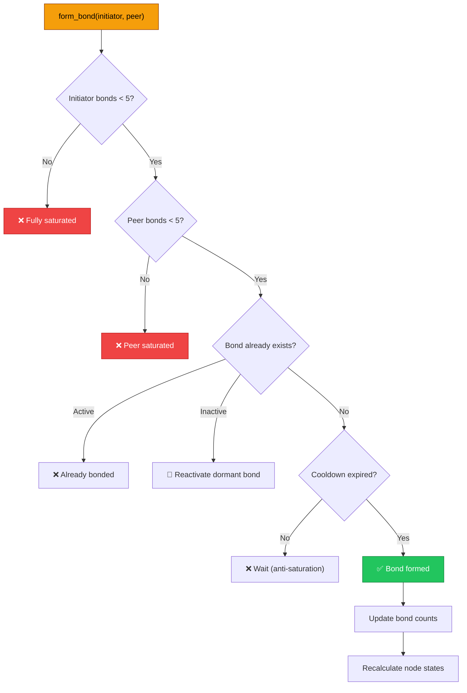

### Bonds Are Undirected — No Hierarchy

```python
# From models/bond.py — always store (smaller, larger) to prevent duplicates
@staticmethod
def ordered_pair(id_1: str, id_2: str) -> tuple:
    return (id_1, id_2) if id_1 < id_2 else (id_2, id_1)

# Database-level uniqueness
__table_args__ = (UniqueConstraint('node_a', 'node_b', name='uq_bond_pair'),)
```

There is no "upline" or "downline." A bond between Alice and Bob is the same bond as Bob and Alice. The ordered-pair normalization + unique constraint makes it structurally impossible to create directional hierarchy.

### Field Traversal — BFS on Undirected Graph

The network engine uses **breadth-first search** to traverse the field. Every discovered node carries:

| Property | Computed By | Meaning |
|:---------|:------------|:--------|
| `hops` | BFS level | Distance from origin |
| `energy_weight` | `1/(2^hops)` | Energy that reaches this node |
| `node_state` | Bond count → state machine | Connectivity level |
| `bond_count` | Active bonds | Progress toward pentagonal saturation |
| `activity` | 30-day rolling window | Settlement qualification score |

```python
# From core/network.py — get_field()
queue = deque([(helios_id, 0)])
while queue:
    current_id, hops = queue.popleft()
    bonds = db.query(Bond).filter(
        ((Bond.node_a == current_id) | (Bond.node_b == current_id)),
        Bond.state == "active"
    ).all()
    for bond in bonds:
        peer_id = bond.peer_of(current_id)
        if peer_id not in visited:
            visited[peer_id] = hops + 1
            queue.append((peer_id, hops + 1))
```

---

## ⚡ Energy Exchange & Conservation Law

### The Conservation Law

> **Every unit of energy that enters the system is accounted for. No leaks. No hidden pools. No phantom balances.**

$$\sum \text{Inflows} = \text{Routed} + \text{Stored} + \text{Pooled} + \text{Burned}$$

Verifiable by anyone: **`GET /api/energy/conservation`**

```python
# From core/energy_exchange.py — verify_conservation()
total_out = total_routed + total_stored + total_pooled + total_burned
balance = round(total_in - total_out, 4)
return { "balanced": abs(balance) < 0.01, "balance": balance }
```

### $100 Entry — Atomic Split

Every dollar has a declared destination. No slush funds.

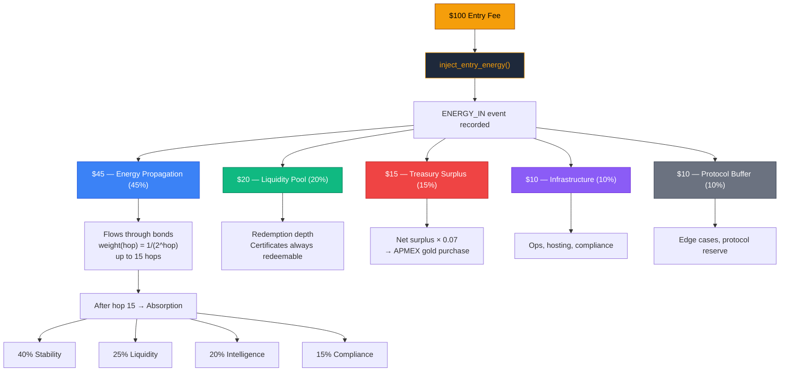

### Propagation — Physics-Based Settlement

When a new node joins, energy radiates outward through bonds via **BFS**. Settlement at each hop decays naturally:

$$\text{weight}(h) = \frac{1}{2^h}$$

```
Hop   Weight        Energy from $45   Visualization
─────────────────────────────────────────────────────
 1    1/2   = 50.0%    $22.50         ████████████████████████████████████████
 2    1/4   = 25.0%    $11.25         ████████████████████
 3    1/8   = 12.5%     $5.63         ██████████
 4    1/16  =  6.25%    $2.81         █████
 5    1/32  =  3.13%    $1.41         ██▌
 6    1/64  =  1.56%    $0.70         █▎
 7    1/128 =  0.78%    $0.35         ▋
 8    1/256 =  0.39%    $0.18         ▎
 ·       ·       ·        ·           ·
15    1/32768= 0.003%   $0.001        ▏ → absorbed into protocol pools
```

### 3-Phase Settlement Engine

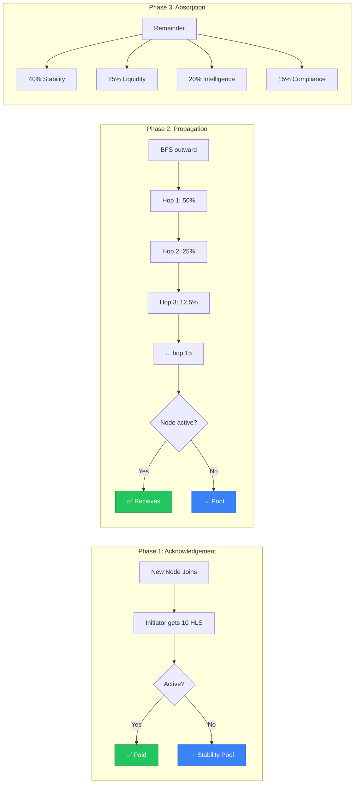

### 4 Energy Instruments

Each instrument has a distinct role — no overlap:

| Instrument | Symbol | Type | Lifecycle | Purpose |
|:-----------|:------:|:-----|:----------|:--------|
| 🏷 **Helios Name** | `name.helios` | Identity NFT | Permanent | Your address in the field. 3–24 chars. Reserved words blocked. |
| ⚡ **Helios Energy** | HE | Utility unit | Transient | Flows through bonds. Decays with distance. Never compounds. |
| 🔋 **Helios Certificate** | HC-NFT | Stored battery | Mint → Redeem/Cancel | Locks energy at a rate. Redeems for gold or stablecoin. |
| 💳 **Helios Vault Credit** | HVC | Accounting unit | Internal | Internal bookkeeping for pool balances and treasury ops. |

### 7 Energy Event Types (Immutable Ledger)

Every energy movement is recorded. There are exactly 7 types:

```
ENERGY_IN      ← External payment → energy enters the system
ENERGY_ROUTE   ← Propagation through a bond (hop-by-hop)
ENERGY_STORE   ← Energy locked into an HC-NFT certificate
ENERGY_POOL    ← Absorbed into a protocol pool (LP, treasury, etc.)
ENERGY_BURN    ← Permanently destroyed (cancel friction, compliance)
ENERGY_REDEEM  ← Certificate → gold or stablecoin exit
ENERGY_CANCEL  ← Certificate cancelled (2% burned, rest returned)
```

---

## 🔄 State Machines

Helios has **4 finite-state machines** — each with strict transition rules enforced in code.

### 1. Node State Machine — Connectivity, Not Rank

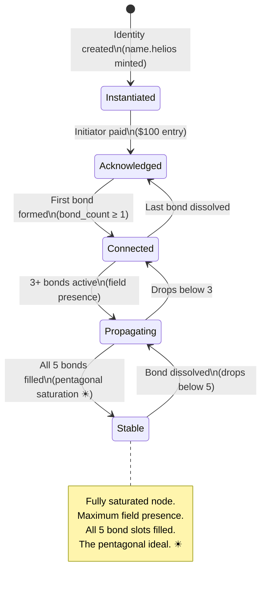

```python
# From models/member.py — automatic state recalculation on every bond change
def update_node_state(self):
    if self.bond_count >= 5:   self.node_state = "stable"       # ☀ Pentagonal saturation
    elif self.bond_count >= 3: self.node_state = "propagating"   # Active field presence
    elif self.bond_count >= 1: self.node_state = "connected"     # Growing
```

### 2. Bond State Machine — Undirected Peer Connections

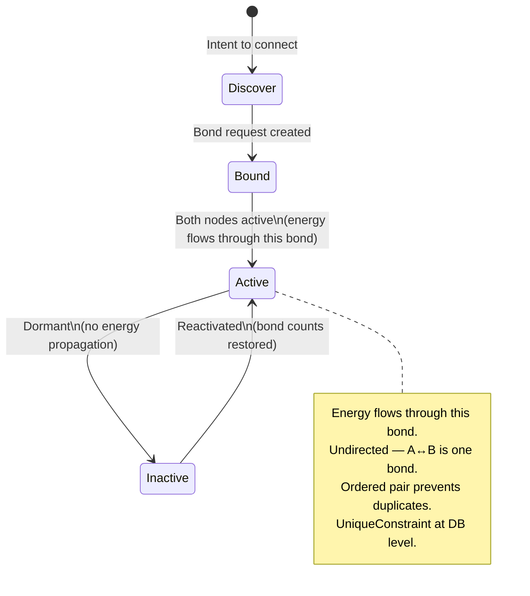

### 3. Certificate State Machine — HC-NFT Lifecycle

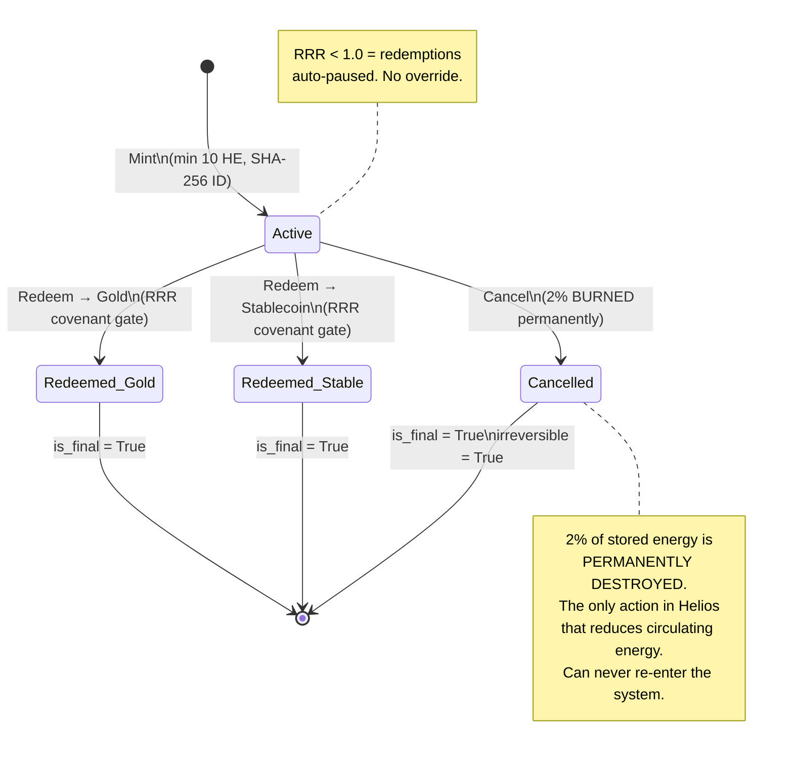

### 4. MVR Custody State Machine — Metal Provenance

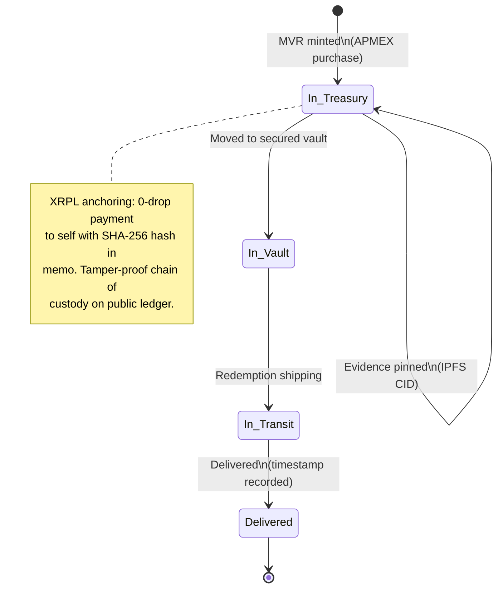

---

## 🌐 Neural Lattice Visualization

The `/field` page renders the bounded field as a **D3.js force-directed graph** — no hierarchy, just physics.

### Design Language

| Feature | Implementation | Why |
|:--------|:---------------|:----|
| **Undirected graph** | `d3.forceLink()` with no arrows | There is no "above" or "below" |
| **5 concentric rings** | Dashed circles radiating from center | 5 hop levels (Power of 5 echo) |
| **Node size = bond count** | `d3.scaleLinear([0,5], [6,18])` | Connectivity determines visual presence |
| **Node color = state** | Gold/blue/purple spectrum | Instant field health at a glance |
| **Energy pulse** | Animated circles traveling bond lines | Shows energy actually flowing |
| **Origin glow** | Extra ring + Gaussian blur filter | You're the center of your own field |
| **☀ on origin** | Unicode sun symbol | The Helios identity |
| **Pentagon geometry** | 5 nodes on coin SVG | Power of 5 in the visual brand |

### Node State Colors in the Lattice

```
stable         #f59e0b  Gold         5/5 bonds — fully saturated ☀
propagating    #fbbf24  Light Gold   3-4 bonds — active field presence
connected      #3b82f6  Blue         1-2 bonds — growing
acknowledged   #8b5cf6  Purple       Entered, no bonds yet
instantiated   #6366f1  Indigo       Identity created
```

### Canvas Lattice Background

The landing page runs a **continuous canvas particle animation** behind the hero coin — a living, breathing neural lattice of gold lines on dark:

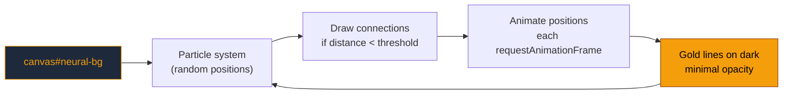

---

## 🔴 Smart Contracts

### Token Contract — HLS

```
╔══════════════════════════════════════════════════════════════╗
║              HLS TOKEN — IMMUTABLE RULES                     ║
╠══════════════════════════════════════════════════════════════╣
║  Total Supply:     100,000,000 HLS                           ║
║  Decimals:         8                                         ║
║  Minting:          IMPOSSIBLE — no mint function in code     ║
║  Admin Override:   IMPOSSIBLE — no admin keys exist           ║
║  Supply Audit:     PUBLIC — GET /api/token/verify             ║
║  Founder Lock:     3 years — enforced in TokenEngine          ║
╚══════════════════════════════════════════════════════════════╝
```

#### Token Allocation

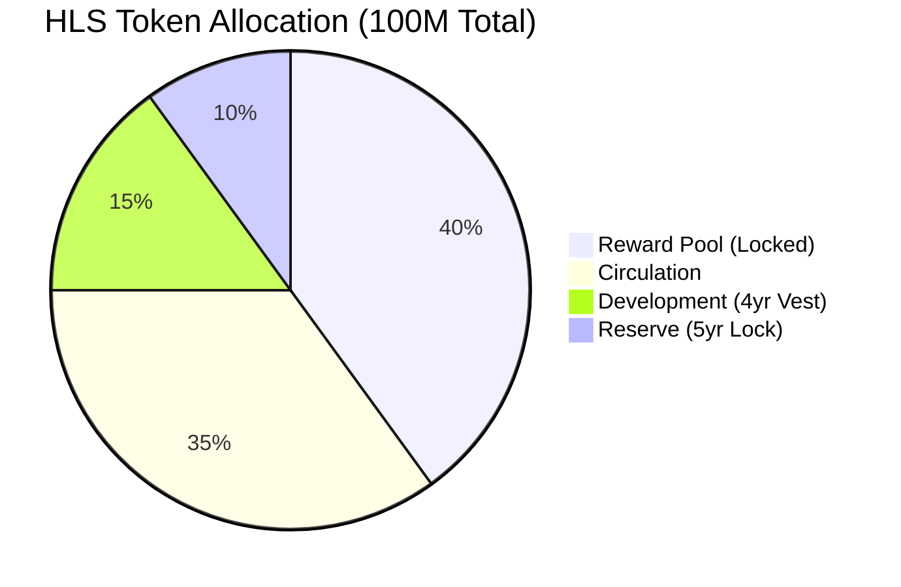

| Pool | % | Amount | Lock | Purpose |
|:-----|--:|-------:|:-----|:--------|
| 🟡 Reward Pool | 40% | 40,000,000 HLS | Smart contract lock | Propagation settlements |
| 🟢 Circulation | 35% | 35,000,000 HLS | — | Network activity |
| 🔵 Development | 15% | 15,000,000 HLS | 4-year vest | Protocol development |
| 🔴 Reserve | 10% | 10,000,000 HLS | 5-year lock | Emergency reserve |

#### Anti-Rug Guarantees

These aren't promises — they're structural facts:

```python
anti_rug = {
    "can_mint": False,              # No minting function exists in the code
    "founder_lock_years": 3,        # Founders locked out for 3 years
    "pool_locked": True,            # Reward pool is smart-contract locked
    "supply_auditable": True,       # GET /api/token/verify — anyone, anytime
    "admin_override_possible": False # No admin keys exist in the protocol
}
```

---

## 🟣 Metrics & Formulas

### SR-Level Protocol Health Dashboard

Four metrics that define protocol health. All publicly queryable.

```
┌─────────────┬─────────────────────────────────────┬────────┬────────┐
│   Metric    │         Formula                     │ Target │ Status │
├─────────────┼─────────────────────────────────────┼────────┼────────┤
│ RRR         │ LiquidTreasury / 30d_Redeem_Demand  │ ≥ 3.0  │ 🟢     │
│ η (Flow)    │ (Routed+Stored+Pooled) / In         │ ≥ 0.95 │ 🟢     │
│ CP (Churn)  │ CancelRequests / ActiveNodes         │ < 0.02 │ 🟢     │
│ V (Vel.)    │ Transfers_7d / StoredEnergy          │ ~ 0.30 │ 🟢     │
└─────────────┴─────────────────────────────────────┴────────┴────────┘
```

#### Reserve Ratio (RRR)

$$RRR = \frac{\text{Liquid Treasury (USD)}}{\text{30-day Redemption Demand (USD)}}$$

| Range | Status | Protocol Action |
|:------|:-------|:----------------|
| 🟢 ≥ 3.0 | **Healthy** | Normal operations |
| 🟡 ≥ 1.5 | **Warning** | Increase metal coefficient |
| 🔴 < 1.0 | **Critical** | **Auto-pause redemptions** — no override |

#### Flow Efficiency (η)

$$\eta = \frac{\text{Routed} + \text{Stored} + \text{Pooled}}{\text{Total Inflows}}$$

Target: **≥ 0.95** — 95%+ of energy goes where it should.

#### Churn Pressure (CP)

$$CP = \frac{\text{Cancel Requests (30d)}}{\text{Active Nodes}}$$

| Range | Status |
|:------|:-------|
| 🟢 < 0.02 | Healthy |
| 🟡 < 0.05 | Warning |
| 🔴 ≥ 0.05 | Review required |

#### Energy Velocity (V)

$$V = \frac{\text{Transfers (7d)}}{\text{Total Stored Energy}}$$

Target: **~0.30** — healthy circulation without instability.

---

## 🛡 RRR Covenant — Automated Circuit Breaker

The most important safety mechanism. An automated circuit breaker with **no human override**.

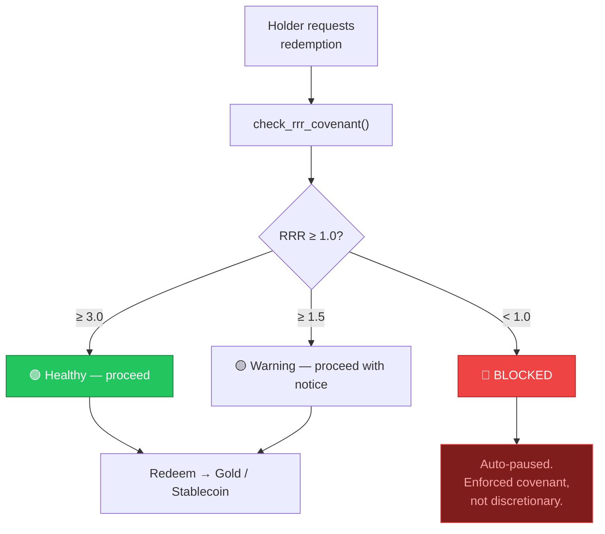

```python
# From core/certificates.py — there is NO bypass
def check_rrr_covenant(self):
    rrr = MetricsEngine(self.db).get_reserve_ratio()
    return {
        "redemption_permitted": rrr["status"] != "critical",  # No override path
    }
```

---

## 🥇 Treasury — Precious Metals Spine

### Metal Allocation Formula

$$\text{MetalAllocation} = \text{NetSurplus} \times m \quad \text{where } 0.05 \leq m \leq 0.12$$

### MVR Lifecycle — 4-Layer Provenance


### MVR Data Structure

| Field | Example | Purpose |
|:------|:--------|:--------|
| `mvr_id` | `MVR-A7F3E2B1C9D4` | Unique receipt ID |
| `dealer` | `APMEX` | Approved dealer only |
| `metal` | `GOLD` | Au, Ag, Pt, Pd |
| `form` / `purity` | `bar` / `0.9999` | Four-nine fine |
| `weight_oz` × `quantity` | `1.0` × `10` | Total troy ounces |
| `serials` | `["SN-12345", ...]` | Physical serial numbers |
| `custody_status` | `in_treasury` | Current state in custody FSM |
| `evidence_bundle_cid` | `Qm...` | IPFS CID |
| `xrpl_tx_hash` | `B4E7...` | On-chain anchor hash |

---

## 🔷 Cryptographic Addressing

### Certificate IDs — Deterministic SHA-256

Certificate IDs aren't random — they're **content-addressed**:

```python
# From models/certificate.py
payload = f"{holder_id}|{energy_amount_he:.8f}|{epoch_timestamp}|{mint_rate:.8f}"
content_hash = hashlib.sha256(payload.encode()).hexdigest()
certificate_id = f"HC-{content_hash[:24].upper()}"
```

**Example:**
```
Input:  alice.helios | 100.00000000 | 1707580800 | 1.00000000
SHA256: a3f2e71b9c4d8f...
ID:     HC-A3F2E71B9C4D8F0123456789
```

Properties:
- **Verifiable** — anyone can reproduce the hash from the 4 inputs
- **Tamper-evident** — changing any input changes the entire ID
- **Content-addressed** — the ID IS the content

### XRPL Anchoring

0-drop payment to self with SHA-256 in the memo — tamper-proof timestamp on a public ledger without storing sensitive data on-chain.

---

## 🟠 Architecture

### System Layers

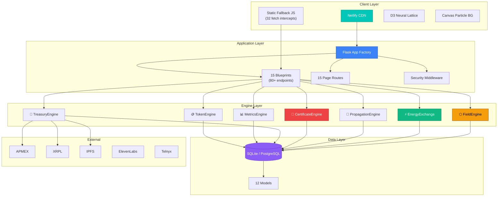

---

## 🟢 Project Structure

```
helios-os/
│
├── 📄 app.py                    ← App factory + security middleware + error handlers
├── 📄 config.py                 ← ALL protocol parameters (299 lines, assert-validated)
├── 📄 wsgi.py                   ← Production WSGI (Waitress)
├── 📄 freeze.py                 ← Static site generator → /build for Netlify
├── 📄 audit.py                  ← System audit (12 categories)
├── 📄 verify_launch.py          ← Launch verification (contracts + metrics)
├── 📄 requirements.txt          ← Pinned dependencies
├── 📄 netlify.toml              ← Build + rewrites + security headers
├── 📄 _headers                  ← CDN edge caching
│
├── 🔷 api/routes.py             ← 15 blueprints, 80+ endpoints
│
├── 🟢 core/                     ← Protocol engines
│   ├── network.py               ← ⬡ FieldEngine — Power of 5, BFS, bonds, graph
│   ├── energy_exchange.py       ← ⚡ EnergyExchange — conservation law, atomic split
│   ├── rewards.py               ← 🔄 PropagationEngine — 3-phase settlement, decay
│   ├── certificates.py          ← 🔋 CertificateEngine — HC-NFT, RRR covenant
│   ├── treasury.py              ← 🥇 TreasuryEngine — metal spine, MVR, XRPL
│   ├── metrics.py               ← 📊 MetricsEngine — RRR, η, CP, V
│   ├── token.py                 ← 🪙 TokenEngine — fixed supply, anti-rug
│   ├── identity.py              ← 🏷 name.helios + 12-word recovery
│   ├── wallet.py                ← 💰 Balance, send, receive
│   ├── spaces.py                ← 🏠 Rooms + events
│   ├── infrastructure.py        ← ⚙️ Cloudflare DNS/SSL
│   ├── sms.py                   ← 📱 Telnyx verification
│   └── voice.py                 ← 🎙 ElevenLabs voice AI
│
├── 🟣 models/                   ← 12 SQLAlchemy models
│   ├── member.py                ← Node (5-state FSM)
│   ├── bond.py                  ← Undirected bond (4-state FSM, ordered pair)
│   ├── certificate.py           ← HC-NFT (3-state FSM, SHA-256 addressed)
│   ├── vault_receipt.py         ← MVR (4-state custody FSM)
│   ├── energy_event.py          ← Immutable ledger (7 event types)
│   ├── reward.py                ← Settlement records
│   ├── transaction.py           ← Activity tracking
│   ├── token_pool.py            ← Pool balances
│   ├── credential.py            ← Operator/vendor credentials
│   ├── space.py                 ← Rooms + events
│   ├── subscription.py          ← Premium tiers
│   └── wallet_tx.py             ← Wallet history
│
├── 🎨 static/
│   ├── css/helios.css           ← Design system (~1100 lines)
│   ├── js/static-fallback.js    ← Netlify fallback (32 fetch intercepts)
│   ├── js/network-viz.js        ← D3 neural lattice (force-directed + pulse)
│   └── img/og-helios.svg        ← Social share card
│
└── 📝 templates/                ← 15 Jinja2 pages
    ├── index.html               ← Spinning coin (pentagonal geometry), lattice BG
    ├── network.html             ← D3 neural field visualization
    ├── vault_gold.html          ← Gold Vault (27 APMEX products)
    ├── join.html                ← 4-step onboarding + referral detection
    ├── activate.html            ← $100 allocation visual bar
    └── ...                      ← dashboard, ask, treasury, vault, metrics, status, error
```

---

## ⚪ API Reference

### Page Routes (15)

| Route | Feature |
|:------|:--------|
| `GET /` | Spinning coin (pentagonal geometry), neural lattice BG |
| `GET /dashboard` | Balance, history, bond status, field view |
| `GET /field` | D3 force-directed neural lattice |
| `GET /ask` | GPT-4 chat + ElevenLabs voice |
| `GET /treasury` | Metal reserves + MVR receipts |
| `GET /vault` | Certificate management (HC-NFTs) |
| `GET /vault/gold` | 🥇 Gold Vault — 27 APMEX products |
| `GET /activate` | $100 allocation breakdown |
| `GET /metrics` | RRR, η, CP, V dashboard |
| `GET /enter/<ref>` | Referral entry |
| `GET /join/<ref>` | 4-step onboarding |

### API Groups (80+ endpoints)

<details>
<summary><strong>⬡ Field</strong> — Power of 5, bonds, BFS graph</summary>

| Endpoint | Description |
|:---------|:------------|
| `POST /api/field/bond` | Create bond (max 5, cooldown, bilateral) |
| `POST /api/field/bond/dissolve` | Dissolve → inactive |
| `GET /api/field/bonds/:id` | Active bonds for node |
| `GET /api/field/graph/:id` | D3 data (nodes + edges + weights) |
| `GET /api/field/stats/:id` | Capacity, reach, health |
| `GET /api/field/path/:a/:b` | BFS shortest path |

</details>

<details>
<summary><strong>⚡ Energy</strong> — Conservation law, inject, propagate</summary>

| Endpoint | Description |
|:---------|:------------|
| `POST /api/energy/inject` | Atomic $100 split + ledger events |
| `POST /api/energy/propagate` | BFS propagation (3-phase) |
| `GET /api/energy/conservation` | ⚖ Conservation law verification |
| `GET /api/energy/balance/:id` | Net energy (in - out) |
| `GET /api/energy/map` | Global flow map |

</details>

<details>
<summary><strong>🔋 Certificates</strong> — HC-NFT, SHA-256, RRR covenant</summary>

| Endpoint | Description |
|:---------|:------------|
| `POST /api/certificates/mint` | Deterministic SHA-256 ID |
| `POST /api/certificates/redeem/gold` | RRR-gated → gold |
| `POST /api/certificates/cancel` | 2% permanently burned |
| `GET /api/certificates/covenant` | RRR covenant check |
| `GET /api/certificates/burned` | Total energy destroyed |

</details>

<details>
<summary><strong>🥇 Treasury</strong> — Metal spine, XRPL</summary>

| Endpoint | Description |
|:---------|:------------|
| `GET /api/treasury/reserves` | Proof of reserves |
| `POST /api/treasury/receipt` | Mint MVR |
| `POST /api/treasury/anchor` | XRPL anchor |
| `POST /api/treasury/custody` | Update custody state |

</details>

<details>
<summary><strong>📊 Metrics · 🪙 Token · 🔐 Identity · 💰 Wallet · More</strong></summary>

| Group | Key Endpoints |
|:------|:--------------|
| Metrics | `/api/metrics/all`, `/api/metrics/rrr`, `/api/metrics/churn` |
| Token | `/api/token/verify`, `/api/token/founder-lock` |
| Identity | `/api/identity/create`, `/api/identity/recover` |
| Wallet | `/api/wallet/balance/:id`, `/api/wallet/send` |
| Rewards | `/api/rewards/protocol`, `/api/rewards/total/:id` |
| Chat | `/api/chat/ask` |
| Voice | `/api/voice/speak` |
| SMS | `/api/sms/verify/send`, `/api/sms/verify/confirm` |

</details>

---

## 🟤 Deployment

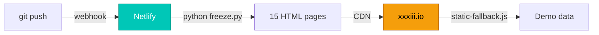

- **Build:** `python freeze.py` → validates HTML, stamps BUILD_ID
- **CDN:** 1-year immutable caching for static assets, 5-min for HTML
- **Rewrites:** `/enter/*`, `/join/*`, `/activate/*` → serve base for referral links
- **Post-processing:** Disabled (prevents HTML corruption)

---

## ⚫ Configuration & Invariants

All protocol parameters in `config.py` (299 lines). Structural assertions at boot:

```python
assert token_allocation == 100%         # 40 + 35 + 15 + 10
assert absorption_pools == 100%         # 40 + 25 + 20 + 15
assert energy_allocation == 100%        # 45 + 20 + 15 + 10 + 10
assert FIELD_MAX_BONDS == 5             # Power of 5
assert PROPAGATION_MAX_HOPS == 15       # Energy horizon
assert ENTRY_FEE_USD == 100             # Atomic entry
assert CERTIFICATE_CANCEL_FRICTION == 0.02  # 2% burn
assert metal_coefficient in [0.05, 0.12]    # Bounded range
```

---

## 🔶 Getting Started

```bash
git clone https://github.com/unykornai/Helios.git
cd Helios
pip install -r requirements.txt
cp .env.example .env
python app.py          # Dev → http://localhost:5050
python wsgi.py         # Production (Waitress)
python freeze.py       # Build for Netlify
python audit.py        # Full system audit
python verify_launch.py # Launch verification
```

---

<div align="center">

### Verify Everything

| Endpoint | Proves |
|:---------|:-------|
| [`/api/token/verify`](https://xxxiii.io/api/token/verify) | 100M supply, no mint |
| [`/api/energy/conservation`](https://xxxiii.io/api/energy/conservation) | ∑in = ∑out |
| [`/api/certificates/covenant`](https://xxxiii.io/api/certificates/covenant) | RRR auto-enforced |
| [`/api/treasury/reserves`](https://xxxiii.io/api/treasury/reserves) | Metal is real + XRPL |
| [`/api/metrics/all`](https://xxxiii.io/api/metrics/all) | 4 health metrics public |
| [`/api/field/status`](https://xxxiii.io/api/field/status) | Field bounded at 5 |

---

### Innovation Map

| System | What's New | How It's Enforced |
|:-------|:-----------|:------------------|
| ⬡ **Pentagonal Geometry** | Bounded field, max 5 bonds, not a tree | Bilateral saturation check + cooldown |
| ⚡ **Conservation Law** | ∑in = routed + stored + pooled + burned | Verified every call, public API |
| 🔄 **4 State Machines** | Nodes (5), bonds (4), certs (3), custody (4) | Code-enforced transitions, no overrides |
| 🌐 **Neural Lattice** | D3 force graph + canvas particle background | Physics-based layout, no hierarchy |
| 🔷 **Crypto Addressing** | `HC-{SHA256[:24]}` deterministic cert IDs | Content-addressed, anyone can verify |
| 🛡 **RRR Covenant** | Auto-pause at RRR < 1.0 | No human override exists in code |
| 🥇 **4-Layer Provenance** | APMEX → MVR → IPFS → XRPL | Each layer independently verifiable |
| 🔋 **Energy Batteries** | HC-NFTs store energy at a rate | Redeem for gold/stablecoin, 2% cancel burn |
| ☀ **Physics Settlement** | `weight(hop) = 1/(2^hop)` via BFS | Position doesn't matter, distance does |
| 🔥 **Permanent Burn** | Cancel friction is the ONLY energy destroyer | Burned energy can never re-enter |

---

**Settlement follows physics, not position.**

**`xxxiii.io`**

☀

</div>
